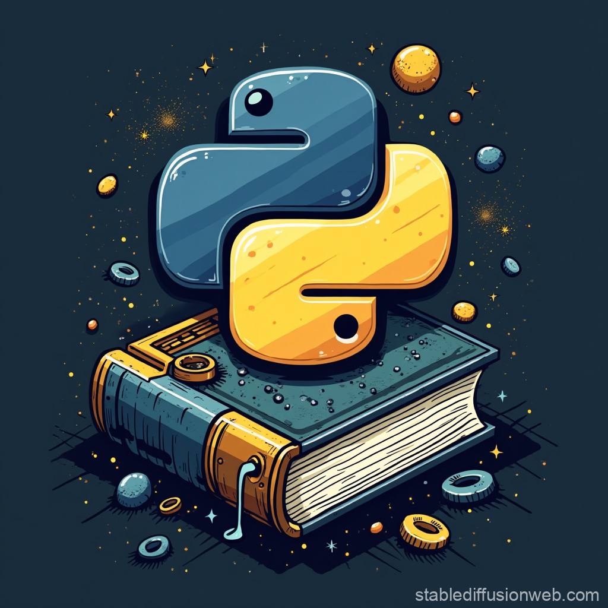

# 🧠 Aula de Lógica de Programação com Python

  

Bem-vindo ao repositório **Aula-Logica-Python**, um projeto desenvolvido para ensinar e praticar lógica de programação utilizando a linguagem Python. Ideal para iniciantes que desejam entender os conceitos fundamentais da programação de forma prática e objetiva.

---

## 🔧 Funcionalidades

- **Exercícios Práticos**: Lista de exercícios para fixação dos conceitos aprendidos.
- **Gestão de Alunos**: Sistema simples para cadastro e gerenciamento de alunos.
- **Exemplos de Código**: Scripts comentados demonstrando estruturas de controle, funções e manipulação de dados.

---

## 🛠️ Tecnologias Utilizadas

- **Linguagem**: Python
- **Paradigma**: Programação Procedural

---

Aula-Logica-Python/ 
├── Aula 19 - Setembro.py 
├── Aula 26 - Setembro.py 
├── Aula 30 - Agosto.py 
├── Gestão de Alunos.py 
├── Lista de Exercicios 1.py 
├── Lista de Exercicios 2.py 
├── Ler 2 num + 8 e 0 sai.py 
└── debug.log 

